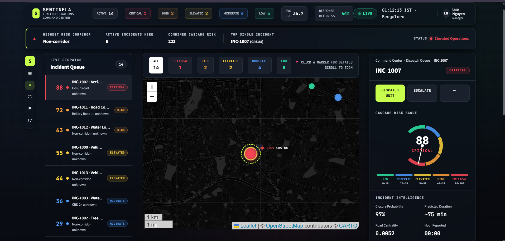
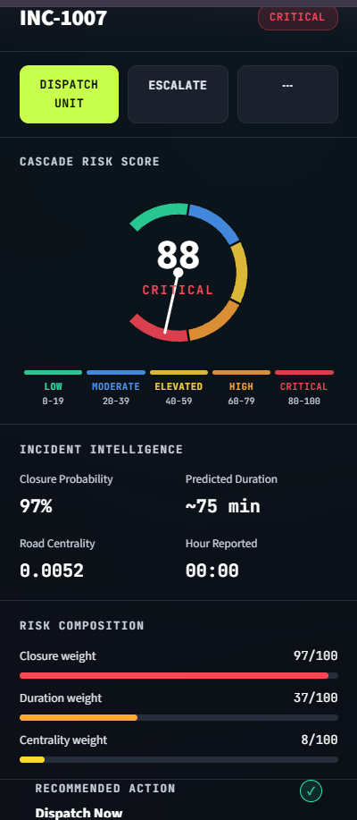
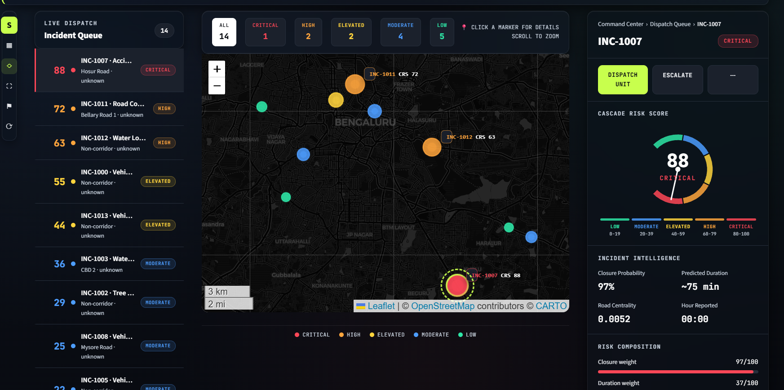
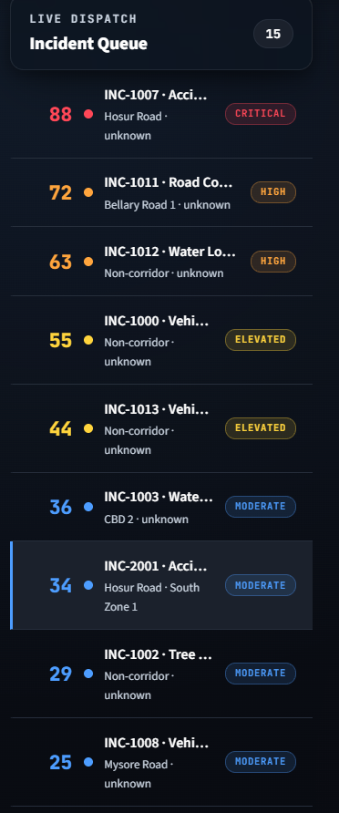
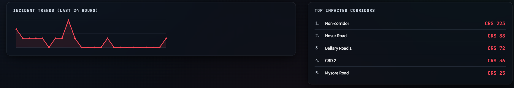
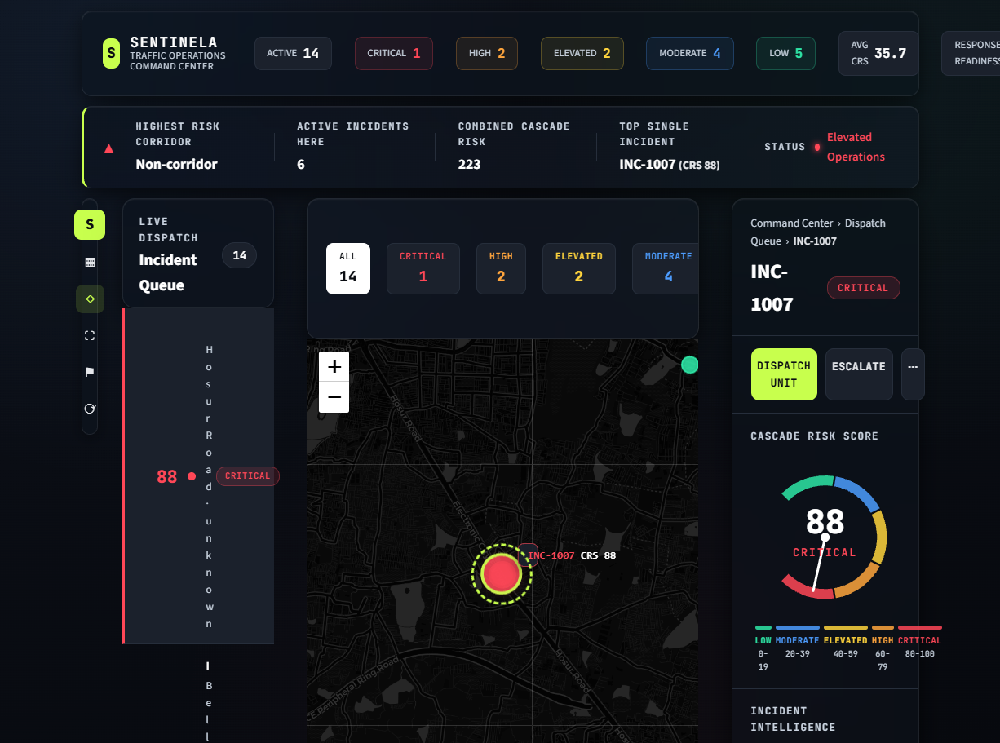
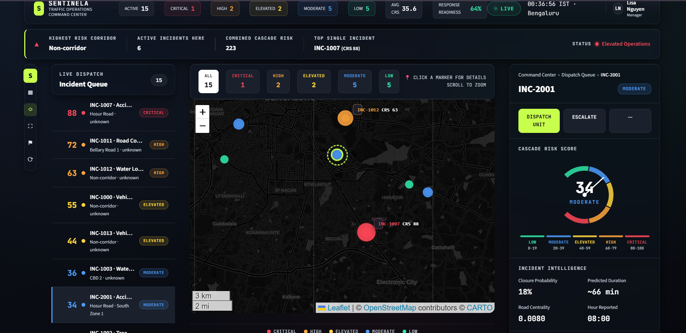

# SENTINELA

### Not Every Incident Deserves the Same Response. SENTINELA Tells You Which Ones Do.

*Cascade-aware traffic intelligence that turns incident severity into city-wide priority.*

Most traffic systems predict *that* congestion will happen. SENTINELA predicts *whether it matters*. By fusing incident-level machine learning predictions with road network graph theory, it converts every incoming incident into a single, rankable priority score — so operators stop reacting to severity labels and start responding to actual city-wide consequence.

### Hackathon Context

Built for **Flipkart GridLock 2.0**, under the theme **"Event-Driven Congestion (Planned & Unplanned)."**

**Operational Challenge:** Political rallies, festivals, sports events, construction activities, and sudden gatherings create localized traffic breakdowns.

**Why It's Hard Today:**
- Event impact is not quantified in advance.
- Resource deployment is experience-driven.
- No post-event learning system.

**Problem Statement Direction:** How can historical and real-time data be used to forecast event-related traffic impact and recommend optimal manpower, barricading, and diversion plans?

**Dataset:** [Astram Event Data (Anonymized)](https://uc.hackerearth.com/he-public-ap-south-1/Astram%20event%20data_anonymized%20-%20Astram%20event%20data_anonymizedb40ac87.csv) — provided by the organizers.

---

---

## 1. Problem Statement

Traffic authorities handle a large volume of incidents every day — accidents, breakdowns, waterlogging, construction blockages, and more. Operations teams typically triage these incidents based on severity alone (e.g., accident vs. minor obstruction).

This approach has a blind spot: **severity does not equal city-wide impact.**

A seemingly minor obstruction on a high-centrality arterial road can choke traffic across an entire zone, while a severe incident on a low-importance side street may have minimal effect on the broader network. Without a way to quantify this difference, operators risk misallocating limited dispatch resources to incidents that matter less, while higher-impact disruptions go unaddressed.

## 2. Key Insight

> **Not all incidents are equal — even if their severity is.**

The true cost of an incident depends on three factors acting together:

- **How likely it is to fully close the road** (closure probability)
- **How long it will take to resolve** (duration)
- **How structurally important that road is to the surrounding network** (centrality)

A short closure on a critical corridor can outweigh a long closure on a peripheral street. SENTINELA is built around quantifying this interaction rather than treating each factor in isolation.

## 3. Solution Overview

SENTINELA is an end-to-end decision intelligence platform that ingests live traffic incident data and converts it into a single, actionable priority signal — the **Cascade Risk Score (CRS)**.

The platform combines machine learning predictions with road network graph analysis to answer one operational question for every incoming incident:

**"If we ignore this incident right now, how much disruption will it cause across the city?"**

The output is surfaced through an interactive operations dashboard that ranks incidents by expected disruption, enabling faster and more informed dispatch decisions.


*The SENTINELA Command Center — live incident counts, average city-wide CRS, response readiness, and the highest-risk corridor surfaced at a glance.*

## 4. System Architecture

```
Traffic Incident
       │
       ▼
Closure Probability Prediction      (Will this incident close the road?)
       │
       ▼
Resolution Duration Prediction      (How long will it take to clear?)
       │
       ▼
Road Network Centrality Analysis    (How important is this road segment?)
       │
       ▼
Cascade Risk Score (CRS)            (Unified disruption priority score)
       │
       ▼
Dispatch Prioritization             (Ranked incident queue)
       │
       ▼
Traffic Operations Dashboard        (Map, queue, intelligence panel)
```

Each stage is modular — models and scoring logic can be retrained or recalibrated independently as more incident data becomes available.

## 5. Cascade Risk Score (CRS)

The Cascade Risk Score is SENTINELA's core contribution: a single, interpretable metric that operators can sort and act on.

**Conceptual formulation:**

```
CRS = f( Closure Probability, Predicted Duration, Road Centrality )
```

- **Closure Probability** — A classification model estimates the likelihood that the incident will result in a partial or full road closure, based on incident type, location, and contextual features.
- **Predicted Duration** — A regression model estimates how long the road is expected to remain affected, informing how long the disruption window will last.
- **Road Centrality** — Using an OpenStreetMap-derived road network graph processed with NetworkX, each road segment is scored on its structural importance (e.g., betweenness centrality), capturing how much traffic flow depends on that segment.

These three signals are combined into a normalized score that reflects **expected city-wide disruption**, allowing incidents to be ranked on a common scale regardless of their individual severity label.


*INC-1007 scored CRS 88 (Critical) — driven primarily by a 97% closure probability, despite only moderate road centrality. This is the exact case severity-only triage would underrank.*

## 6. Dashboard Features

The Traffic Operations Dashboard is the operator-facing layer of SENTINELA, built with Streamlit and Folium.

- **Interactive Bengaluru Risk Map** — Geospatial visualization of active incidents overlaid on the road network
- **Live Incident Queue** — Incidents ranked by Cascade Risk Score for fast triage
- **Severity-Based Visualization** — Color-coded markers and layers reflecting risk level
- **Incident Intelligence Panel** — Drill-down view of closure probability, predicted duration, and road centrality for a selected incident
- **Dispatch Recommendations** — Suggested response priority based on computed CRS


*Incidents plotted on the live Bengaluru road network, color-coded by risk tier. Selecting a marker opens the Incident Intelligence panel with a full CRS breakdown.*


*The Live Dispatch Queue, ranked by Cascade Risk Score rather than report order — operators see the highest-consequence incident first, every time.*


*24-hour incident trend alongside the top impacted corridors by combined CRS, helping operators spot which corridors are absorbing repeated disruption.*

## 7. Technology Stack

| Category | Tools |
|---|---|
| Language | Python |
| Web App / Dashboard | Streamlit |
| Machine Learning | Scikit-Learn |
| Data Processing | Pandas, NumPy |
| Geospatial Visualization | Folium |
| Road Network Data | OpenStreetMap |
| Graph / Centrality Analysis | NetworkX |

## 8. Project Structure

```
SENTINELA/
├── .streamlit/
│   └── config.TOML                       # Streamlit app configuration
├── cache/                                # Cached intermediate computations
├── data/
│   ├── raw/
│   │   └── astram_raw.csv                # Raw incident data
│   ├── interim/
│   │   └── bengaluru_drive_graph.g...     # Intermediate OSM road graph
│   └── processed/
│       ├── astram_modelling_ready....csv  # Cleaned, feature-engineered dataset
│       └── astram_with_centrality.csv     # Dataset enriched with centrality scores
├── models/
│   ├── closure_model.pkl                 # Trained closure prediction model
│   ├── resolution_model.pkl              # Trained duration prediction model
│   └── feature_metadata.json             # Feature schema / metadata
├── notebooks/                            # Exploratory analysis and experimentation
├── reports/
│   ├── centrality_audit.md               # Road centrality analysis report
│   ├── classification_feature_imp...     # Closure model feature importance
│   ├── model_report.md                   # Consolidated model performance report
│   └── regression_feature_import...      # Duration model feature importance
├── Screenshots/
│   ├── bengaluru-risk-map.png
│   ├── corridor-analysis.png
│   ├── critical-incident.png
│   ├── crs-analysis.png
│   ├── dashboard-overview.png
│   ├── demo-scenario.png
│   └── dispatch-prioritization.png
├── src/
│   ├── data_prep.py                      # Data cleaning and preparation
│   ├── preprocess.py                     # Feature engineering pipeline
│   ├── centrality.py                     # Road network centrality analysis
│   ├── train_models.py                   # Closure & duration model training
│   ├── cascade_risk_score.py             # CRS computation logic
│   ├── dashboard.py                      # Streamlit dashboard entry point
│   └── debug.py                          # Debugging utilities
├── requirements.txt
└── README.md
```

## 9. Installation

**Prerequisites:** Python 3.9 or higher

```bash
# Clone the repository
git clone https://github.com/<sheetalkumari2004-del>/sentinela.git
cd sentinela

# Create and activate a virtual environment
python -m venv venv
source venv/bin/activate      # On Windows: venv\Scripts\activate

# Install dependencies
pip install -r requirements.txt
```

## 10. How to Run

```bash
# Launch the Streamlit dashboard
streamlit run src/dashboard.py
```

The dashboard will be available at `http://localhost:8501` by default.

To retrain or update the underlying models:

```bash
python src/data_prep.py
python src/preprocess.py
python src/centrality.py
python src/train_models.py
```

## 11. Results and Impact

Across simulated and historical Bengaluru incident scenarios, SENTINELA's network-aware ranking diverged meaningfully from severity-only triage — and in the direction that matters operationally.

- **Re-ranked priority, not just re-scored severity.** Moderate-severity incidents on high-centrality corridors were consistently escalated above higher-severity incidents on peripheral roads — the exact blind spot conventional triage misses.
- **Collapsed a multi-factor judgment call into one number.** Closure likelihood, resolution time, and road importance — three signals an operator would otherwise have to mentally cross-reference under time pressure — are fused into a single CRS an operator can act on in seconds.
- **Built to improve without disruption.** Closure and duration models retrain independently of the scoring and dashboard layers, so accuracy improves over time without re-engineering the operational tool operators already trust.

The core finding: **incident severity and incident consequence are not the same thing** — and treating them as interchangeable is where current triage systems lose time that SENTINELA is built to recover.


*A Critical-tier incident (CRS 88) driving the command center into "Elevated Operations" status — the highest single incident determines overall posture, not the average.*


*Side-by-side: INC-1007 (CRS 88, Critical) versus INC-2001 (CRS 34, Moderate) on the same corridor — the same map, two very different dispatch priorities.*

## 12. Future Scope

- Integration with live traffic incident feeds and real-time GPS-based congestion data
- Expansion of the road network model to include lane-level and time-of-day-specific centrality
- Incorporation of weather, event, and historical congestion data as additional predictive features
- Multi-city support beyond Bengaluru through configurable road graph ingestion
- Feedback loop allowing operator outcomes to retrain and recalibrate the prediction models
- Mobile-friendly interface for field response teams

## 13. Team

Built end-to-end for Flipkart GridLock 2.0 — from data pipeline and model development to network analysis and dashboard design.

---

**SENTINELA** — Severity is loud. Consequence is silent. We listen for the second one.
